# 👋 Olá, eu sou Gabriel Silva!

<div align="center">
  
</div>

<div align="center">
  
</div>

## 🚀 Sobre mim

```typescript
const gabriel = {
  nome: "Gabriel Silva",
  localização: "Juiz de Fora - MG 🇧🇷",
  educação: "Estudante do Vianna Júnior",
  focoAtual: "Desenvolvimento Full Stack",
  aprendendo: ["TypeScript", "Java", "HTML/CSS"],
  interesses: ["Programação", "Tecnologia", "Inovação"],
  objetivo: "Criar soluções que impactem positivamente as pessoas"
};
```

## 🛠️ Tecnologias & Ferramentas

<div align="center">
  
### Linguagens


### Ferramentas


</div>

## 📊 Estatísticas do GitHub

<div align="center">
  
  
</div>

<div align="center">
  
</div>

## 🎯 Projetos em Destaque

### 🌐 [Landing Page](https://github.com/GabrielSilvaVG/landing-page)
> Página web criada como projeto de aprendizado em HTML e CSS
- **Tecnologias:** HTML, CSS
- **Objetivo:** Praticar fundamentos de desenvolvimento web

### 🎪 [SIGEI - Sistema de Gerenciamento de Eventos](https://github.com/GabrielSilvaVG/SIGEI)
> Sistema completo para cadastro e gerenciamento de eventos e participantes
- **Tecnologias:** Java
- **Conceitos:** POO, Estruturas de Dados
- **Funcionalidades:** Cadastro de eventos, gerenciamento de participantes

### 📅 [Idade Precisa](https://github.com/GabrielSilvaVG/IdadePrecisa)
> Calculadora de idade precisa desenvolvida em TypeScript
- **Tecnologias:** TypeScript
- **Funcionalidade:** Cálculo exato de idade (anos, meses e dias)

## 📈 Atividade no GitHub

<div align="center">
  
</div>

## 🎓 Jornada de Aprendizado

```mermaid
graph LR
    A[🌱 Iniciante] --> B[📚 Estudando]
    B --> C[💻 Praticando]
    C --> D[🚀 Desenvolvendo]
    D --> E[🎯 Especialista]
    
    style A fill:#ff6b6b
    style B fill:#ffd93d
    style C fill:#6bcf7f
    style D fill:#4ecdc4
    style E fill:#45b7d1
```



## 🌟 Objetivos 2025

- [ ] 🚀 Dominar TypeScript completamente
- [ ] 🎯 Aprender React.js
- [ ] 🌐 Criar meu primeiro projeto full-stack
- [ ] 📱 Desenvolver uma aplicação mobile
- [ ] 🤝 Contribuir para projetos open source

## 📫 Vamos nos conectar?

<div align="center">
  
[](https://www.linkedin.com/in/gabrielsilva2004/)
[](https://www.instagram.com/gabrielsilva.vg/)
[](https://github.com/GabrielSilvaVG)

</div>

---

<div align="center">
  
**"A jornada de mil linhas de código começa com um único commit"** 💻✨

*Feito com ❤️ por Gabriel Silva*

</div>

<div align="center">
  
</div>
